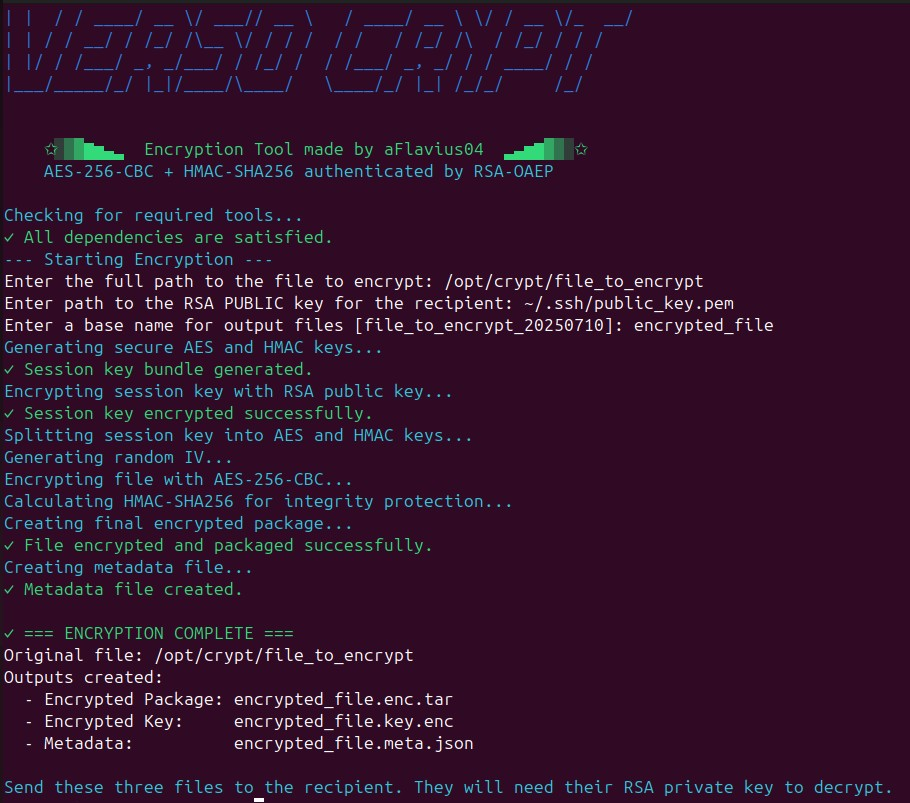
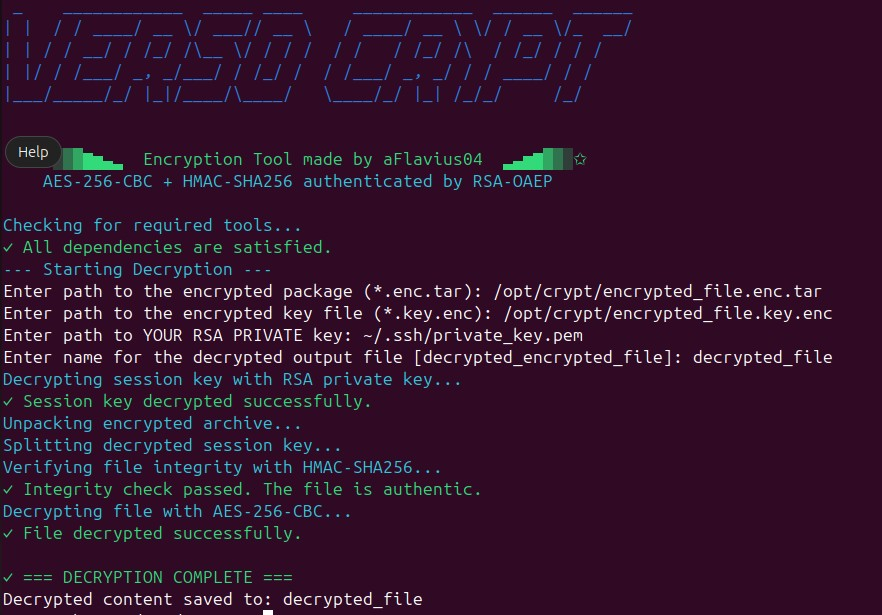

# verso-crypt

Encryption & Decryption Script

**Author**: aFlavius04  
**Version**: 1.0

---

This Bash script provides a secure way to encrypt and decrypt files using a hybrid cryptographic scheme combining **AES-256-CBC** for file encryption and **RSA (OAEP)** for encrypting session keys. It also includes **HMAC-SHA256** for message authentication to ensure data integrity.

>  **Disclaimer**: This script was created for educational and testing purposes only. While I tried my best to follow cryptographic best practices, there is **no guarantee** of absolute security or suitability for production use and I am sure that there are better suited tools for that case. Use it at your own risk.

---

## 🔐 Features

- **Hybrid encryption**: Uses AES-256-CBC symmetric encryption for file content and RSA public/private keys for secure session key exchange.
- **Authentication**: Uses HMAC-SHA256 to verify integrity before decryption (Encrypt-then-MAC).
- **Secure temporary directory management**: Stores temp data in memory (`/dev/shm`) to minimize disk writes.
- **Modern and legacy RSA support**: Defaults to RSA-OAEP with SHA-256, with fallback to PKCS1 v1.5 for older keys.
- **Metadata generation**: Generates a `.meta.json` file with info about the encryption process.


---

## ⚙️ Requirements

- `bash` (written and tested on version 5.2.21) (version 4+ recommended)
- `openssl`
- `tar`
- `head`, `tail`
- `xxd`
- `cmp`

---

## 🚀 Usage

### 🔒 Encrypt a file

```bash
./verso-crypt.sh encrypt
```

You will be prompted to enter:
- Path to the file you want to encrypt
- Path to the RSA public key (PEM format)

### 📁 Output Files
- `[filename].key.enc` – Encrypted RSA key bundle
- `[filename].meta.json` – JSON file with encryption metadata
- `[filename].enc.tar` – Tar archive containing:
  - Encrypted ciphertext
  - Initialization vector (IV)
  - HMAC (authenticity check)




### 🔓 Decrypt a file

```bash
./verso-crypt.sh decrypt
```

You will be prompted to enter:
- Path to the encrypted archive (*.enc.tar)
- Path to the encrypted key file (*.key.enc)
- Path to the RSA private key (PEM format)
- Name for the decrypted output file


The script will:
- Decrypt the session keys
- Verify the HMAC
- Decrypt the file (only if verification passes)



### Note
If you don't have a public and a private key, you can generate them like this:
```bash
openssl genpkey -algorithm RSA -out private_key.pem -pkeyopt rsa_keygen_bits:2048

openssl rsa -pubout -in private_key.pem -out public_key.pem
```